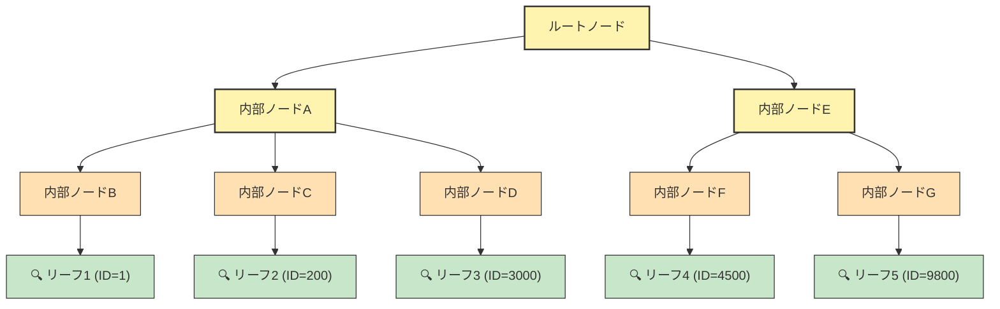

# 5章: B+Tree検索の効率性 — インデックス・Disk I/O・キャッシュの関係

> **この章で理解できること:**
>
> - B+Tree 検索がフルスキャンと比べてどれほど Disk I/O を削減できるか（具体的な数値で）
> - 現在の sqlight の Pager が持つ責任範囲とその限界
> - キャッシュ（バッファプール）が I/O をさらに減らす仕組み
> - インデックス → キャッシュ → OS という3段階の効率化モデル
> - sqlight の Pager と MySQL の Buffer Pool の設計の違い

---

## 5-1. B+Tree検索のDisk I/Oコスト — 具体例で考える

3章・4章で B+Tree の構造と実装を見てきた。ここでは「実際にどれだけ Disk I/O が減るのか」を、具体的な数値で確認する。

### 前提条件

- データ件数: 10,000件
- ページサイズ: 4,096バイト
- 1ページあたりのレコード数: 約4件
- リーフページ数: 約2,500ページ
- B+Tree の高さ: 4（ルート → 内部 → 内部 → リーフ）
- 検索対象: ID = 1, 200, 3000, 4500, 9800 の5件

### インデックスなし（フルスキャン）の場合

リーフを左から右へすべて走査する。

```
リーフを左から右へ全部舐める = 約2,500ページの readPage()
```

目的のレコードがどこにあるかわからないため、全ページを読み込む必要がある。

### インデックスあり（B+Tree検索 × 5回）の場合

```
ID=1:     ルート → 内部 → 内部 → リーフA   = 4回の readPage()
ID=200:   ルート → 内部 → 内部 → リーフB   = 4回の readPage()
ID=3000:  ルート → 内部 → 内部 → リーフC   = 4回の readPage()
ID=4500:  ルート → 内部 → 内部 → リーフD   = 4回の readPage()
ID=9800:  ルート → 内部 → 内部 → リーフE   = 4回の readPage()
───────────────────────────────────────────
合計: 最大20回の readPage()
```

キャッシュがなくても **2,500回 vs 20回** で、インデックスだけで **125倍** の差がある。

---

## 5-2. 「Pager があれば Disk I/O は気にしなくてOK」は誤解

### Pager の readPage() がやっていること

現在の sqlight の Pager（`src/storage/pager.ts`）は、ページ番号からファイル内の位置を **即座に計算できる** だけであり、`readPage()` を呼ぶたびに実際に `fs.readSync()` でディスクを読みに行っている。

```typescript
// src/storage/pager.ts — readPage() の核心部分
const offset = pageNum * this.pageSize;  // ページ3 → 12288バイト目（計算は一瞬）
readSync(this.fd, buf, 0, this.pageSize, offset);  // ← 実際の Disk I/O は毎回発生
```

### Pager の責任範囲

Pager は以下の2つを担っている:

1. **ページ番号 → ファイル内オフセットの変換** — 計算は O(1) で高速
2. **実際のディスク読み書き** — `readSync()` / `writeSync()` による I/O

つまり Pager は「**どこを読むか迷わない**」という意味では効率的だが、**I/O の回数自体を減らす機能は持っていない**。20回の `readPage()` が呼ばれれば、20回のディスクアクセスが発生する。

---

## 5-3. Disk I/O を本当に減らすのはキャッシュ（バッファプール）

### 上位ノードの重複に注目する

5-1 の20回の `readPage()` の内訳をよく見ると、上位ノードに重複がある。

```
ID=1:     ルート → 内部A → 内部B → リーフ1
ID=200:   ルート → 内部A → 内部C → リーフ2
ID=3000:  ルート → 内部A → 内部D → リーフ3
ID=4500:  ルート → 内部E → 内部F → リーフ4
ID=9800:  ルート → 内部E → 内部G → リーフ5
```

- **ルートノード**: 5回中5回アクセス（すべての検索で通る）
- **内部ノードA**: 5回中3回アクセス
- **内部ノードE**: 5回中2回アクセス

### B+Tree 探索パスとキャッシュ対象の可視化

以下の図で、ノードの色がキャッシュ効果の高さを示している。



- 🟡 **黄色**（ルート・内部ノードA・E）= 複数の検索で共有され、キャッシュ効果が高い
- 🟠 **オレンジ**（内部ノードB〜G）= 一部共有される中間層
- 🟢 **緑**（リーフ）= 検索ごとに異なるページを読む（キャッシュヒットしにくい）

### キャッシュがあれば何が変わるか

キャッシュがあれば、2回目以降のルートや内部ノードの読み込みは **メモリから返せる**。

| 検索対象 | Disk I/O（キャッシュなし） | Disk I/O（キャッシュあり） |
|---|---|---|
| ID=1（1回目） | ルート + 内部A + 内部B + リーフ1 = **4回** | 4回（すべて初回読み込み） |
| ID=200（2回目） | ルート + 内部A + 内部C + リーフ2 = **4回** | 内部C + リーフ2 = **2回**（ルート・内部Aはキャッシュ） |
| ID=3000（3回目） | ルート + 内部A + 内部D + リーフ3 = **4回** | 内部D + リーフ3 = **2回** |
| ID=4500（4回目） | ルート + 内部E + 内部F + リーフ4 = **4回** | 内部E + 内部F + リーフ4 = **3回**（ルートはキャッシュ） |
| ID=9800（5回目） | ルート + 内部E + 内部G + リーフ5 = **4回** | 内部G + リーフ5 = **2回**（ルート・内部Eはキャッシュ） |
| **合計** | **20回** | **13回** |

システムが長時間動くと、上位ノードはほぼ永久にキャッシュに残り、**1件の検索 ≒ リーフ1ページだけの Disk I/O** に収束する。

---

## 5-4. 効率化の3段階モデル

ここまでの内容を3段階に整理する。

```
段階1: インデックス（B+Tree）
  → 読むべきページ数を O(n) から O(log n) に減らす
  → フルスキャン 2,500回 → 20回

段階2: キャッシュ（バッファプール）
  → 同じページの再読み込みをゼロにする
  → 20回 → 実質5〜6回（リーフだけ）

段階3: OSのページキャッシュやSSD
  → 残った Disk I/O すら速くなる
  → ハードウェアレベルの最適化
```

| 段階 | 仕組み | 効果 | I/O 回数の目安 |
|---|---|---|---|
| なし（フルスキャン） | — | — | 2,500回 |
| 段階1: B+Tree | 読むべきページを絞る | O(n) → O(log n) | 20回 |
| 段階2: キャッシュ | 重複読み込みをメモリで返す | 上位ノードの I/O 除去 | 5〜6回 |
| 段階3: OS/SSD | 残った I/O を高速化 | レイテンシ短縮 | 5〜6回（だが高速） |

各段階は独立しており、**段階を重ねるほど効果が積み上がる** 設計になっている。

---

## 5-5. sqlight の Pager と MySQL の Buffer Pool の関係

現在の sqlight の Pager は、MySQL の Buffer Pool が持つ責任範囲の **一部だけ** を担っている。

| 責任 | MySQL Buffer Pool | sqlight Pager |
|---|---|---|
| ページ番号 → ディスク位置の変換・読み書き | ✅ | ✅ |
| 読んだページのメモリキャッシュ | ✅ | ❌ |
| ページ追い出し戦略（LRU等） | ✅ | ❌ |
| ダーティページ管理とフラッシュ | ✅ | ❌ |

### キャッシュ機能を追加するなら

もしキャッシュ機能を追加する場合、Pager の `readPage()` 内部に手を入れるのが自然な設計になる。B+Tree 側のコードは一切変えずに済む（Pager が B+Tree とディスクの間の「窓口」として機能しているため）。

```typescript
// キャッシュ付き readPage() のイメージ
readPage(pageNum: number): PagerResult<Buffer> {
  if (this.cache.has(pageNum)) {
    return ok(this.cache.get(pageNum)!);  // Disk I/O なし
  }
  const offset = pageNum * this.pageSize;
  const buf = Buffer.alloc(this.pageSize);
  readSync(this.fd, buf, 0, this.pageSize, offset);
  this.cache.set(pageNum, buf);
  return ok(buf);
}
```

このように、**Pager の内部だけを変更すれば、B+Tree を含む上位レイヤーは何も変えなくてよい**。これは 4章で見た Pager の設計（B+Tree とディスクの間の抽象化レイヤー）が正しく機能している証拠でもある。

---

## まとめ

| 観点 | 要点 |
|---|---|
| インデックスの効果 | フルスキャン 2,500回 → B+Tree 検索 20回（125倍の削減） |
| Pager の現状 | 位置計算は高速だが、I/O 自体は毎回発生する |
| キャッシュの効果 | 上位ノードの重複 I/O を除去し、実質リーフだけの I/O に収束 |
| 効率化の段階 | インデックス → キャッシュ → OS/SSD の3段階で積み上がる |
| 拡張の方針 | Pager 内部にキャッシュを追加すれば B+Tree 側は変更不要 |

> **次のステップ:**
>
> - キャッシュ機能の実装に興味がある場合は、LRU（Least Recently Used）アルゴリズムを用いたバッファプールの設計を検討するとよい
> - 現在の sqlight のコードで `readPage()` の呼び出し回数をカウントするログを追加すると、実際の I/O パターンを観察できる
