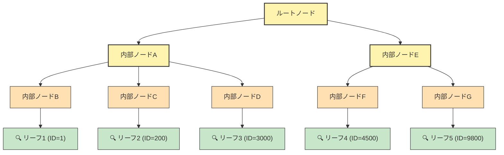

# 仕様書: B+Tree検索の効率性 — インデックス・Disk I/O・キャッシュの関係

## Issue

- GitHub Issue: [#4 ドキュメント追加提案: B+Tree検索の効率性 — インデックス・Disk I/O・キャッシュの関係](https://github.com/h5y1m141/scrath_sql_light/issues/4)

## 要約

3章のノード分割の解説を深掘りする中で発見された「インデックスがあれば検索が速い」という知識と、実際の Disk I/O の仕組みの間のギャップを埋める解説ドキュメントを `doc/` に追加する。

## 解決したい課題

- B+Tree のインデックスがなぜ高速なのか、Disk I/O の回数という具体的な数値で理解できる資料がない
- 現在の sqlight の Pager が「ページ位置の計算」のみを担っており、キャッシュ機能を持たないことが明確に説明されていない
- インデックス → キャッシュ → OS レベルという3段階の効率化モデルが体系的に整理されていない
- sqlight の Pager と MySQL の Buffer Pool の責任範囲の違いが明示されていない

## ユーザーストーリー

### ストーリー1: B+Tree検索のDisk I/Oコストを理解する

- **Given**: 読者が B+Tree のインデックス構造は理解しているが、Disk I/O コストの具体的なイメージがない
- **When**: 10,000件のデータから5件を検索する具体例（フルスキャン vs B+Tree検索）を読む
- **Then**: フルスキャン約2,500回 vs B+Tree検索最大20回という100倍以上の差を数値で理解できる

### ストーリー2: Pager の役割の限界を正しく認識する

- **Given**: 読者が「Pager があれば Disk I/O は効率的」と漠然と考えている
- **When**: Pager の `readPage()` が毎回 `fs.readSync()` を呼んでいるコード例を見る
- **Then**: Pager は「どこを読むか迷わない」だけであり、I/O 自体を減らす機能は持っていないことを理解できる

### ストーリー3: キャッシュ（バッファプール）の効果を理解する

- **Given**: 読者がインデックスによる検索効率は理解したが、さらなる最適化手段を知らない
- **When**: 上位ノードの重複読み込みとキャッシュの関係、および3段階の効率化モデルを読む
- **Then**: キャッシュにより20回のI/Oが実質5〜6回に減ること、さらにOSレベルの最適化があることを理解できる

### ストーリー4: sqlight と MySQL の設計の違いを把握する

- **Given**: 読者が sqlight の Pager 実装を理解している
- **When**: MySQL Buffer Pool との責任範囲の比較表とキャッシュ付き `readPage()` のコード例を読む
- **Then**: 将来キャッシュ機能を追加する場合の設計方針（Pager 内部への追加）を理解できる

## 機能要件

### ドキュメント構成

1. **B+Tree検索のDisk I/Oコスト — 具体例で考える**
   - 10,000件データから5件取得のケーススタディ
   - フルスキャン（約2,500ページ）vs B+Tree検索（最大20回）の比較

2. **「Pager があれば Disk I/O は気にしなくてOK」は誤解**
   - `readPage()` の内部実装（`fs.readSync()` が毎回発生）の解説
   - Pager の責任範囲の明確化

3. **Disk I/O を本当に減らすのはキャッシュ（バッファプール）**
   - 上位ノードの重複読み込みの具体例
   - キャッシュによるI/O削減効果（20回 → 5〜6回）

4. **効率化の3段階モデル**
   - 段階1: インデックス（B+Tree） — O(n) → O(log n)
   - 段階2: キャッシュ（バッファプール） — 重複I/Oの除去
   - 段階3: OSのページキャッシュやSSD — 残ったI/Oの高速化

5. **sqlight の Pager と MySQL の Buffer Pool の関係**
   - 責任範囲の比較表
   - キャッシュ付き `readPage()` のコード例（将来の拡張イメージ）

### 配置

- `doc/` ディレクトリ内に新しいドキュメントファイルとして追加
- 3章（`doc/chapter3_storage_engine_concepts.md`）のノード分割セクションの後に位置付ける内容のため、章立てとしては3章の補足 or 新たな章として配置を検討

### 関連ファイル

- `doc/chapter3_storage_engine_concepts.md` — ノード分割の概念説明
- `doc/chapter4_storage_engine_impl.md` — Pager / B+Tree の実装詳細
- `src/storage/pager.ts` — 現在のPager実装（キャッシュなし）
- `src/db/btree.ts` — B+Tree の検索・挿入・分割

## 図の仕様（Mermaid）

### B+Tree 探索パスとキャッシュ対象の可視化

目的: 5件の検索で上位ノードが共有されること、キャッシュが効く理由を視覚的に示す。

- 黄色ノード（ルート・内部ノードA・E）= 複数検索で共有されキャッシュ効果が高い
- オレンジノード（内部ノードB〜G）= 一部共有される中間層
- 緑ノード（リーフ）= 検索ごとに異なるページを読む（キャッシュヒットしにくい）

## 成功基準

- [ ] `doc/` 配下に B+Tree 検索のDisk I/Oコストとキャッシュの関係を解説するドキュメントが追加されている
- [ ] 10,000件データの具体例を用いた フルスキャン vs B+Tree 検索のI/O回数比較が記載されている
- [ ] 現在の sqlight Pager が毎回 Disk I/O を行っていることがコード例付きで説明されている
- [ ] キャッシュ（バッファプール）による I/O 削減効果が上位ノード重複の具体例で説明されている
- [ ] 効率化の3段階モデル（インデックス → キャッシュ → OS）が整理されている
- [ ] sqlight Pager と MySQL Buffer Pool の責任範囲比較表が含まれている
- [ ] キャッシュ付き `readPage()` の将来的な実装イメージが示されている
- [ ] 既存ドキュメント（chapter3, chapter4）との整合性が取れている
